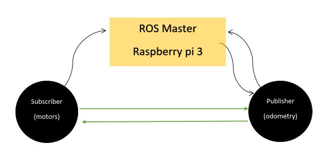
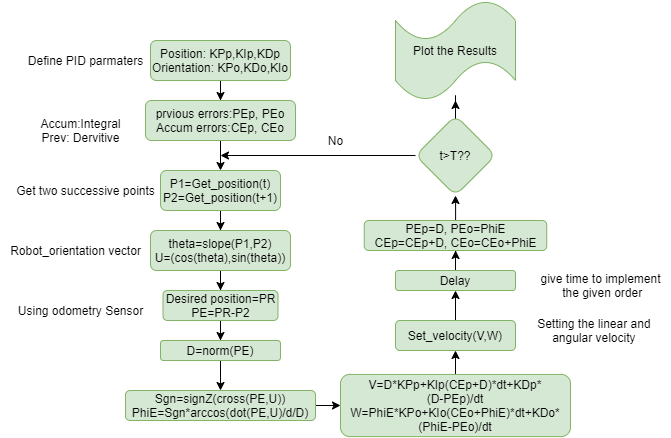
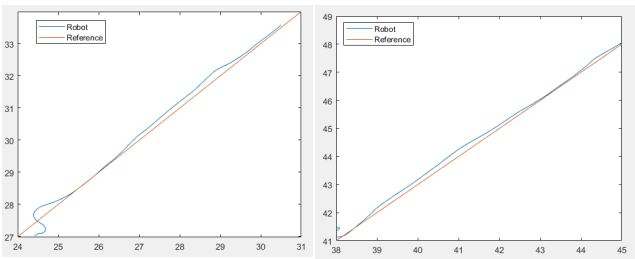
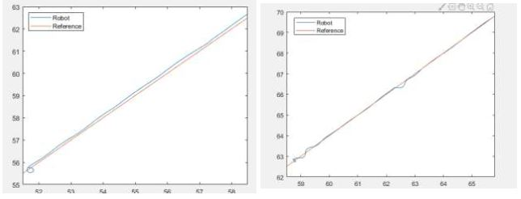
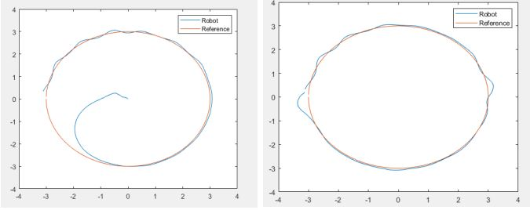
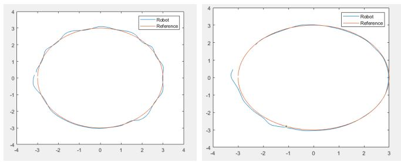
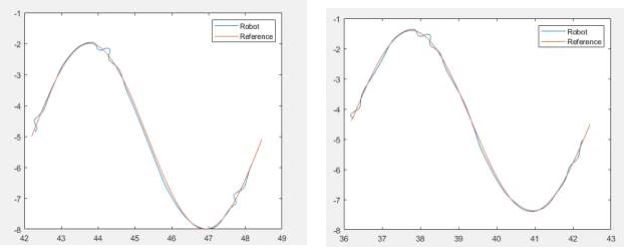
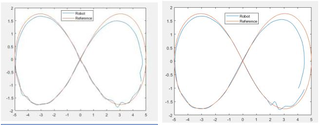
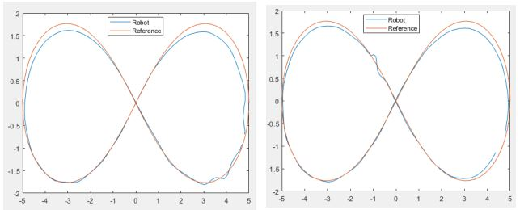

# Trajectory-Tracking-Using-TurtleBot3-Mobile-Robot
This GitHub repository is dedicated to a robotics project that explores the application of PID controllers for trajectory tracking using the TurtleBot3. It includes experiments and documentation on navigating predefined paths with optimized PID parameters, leveraging ROS for real-time control.

## Overview
This GitHub repository contains the code and documentation for a trajectory-tracking robot project using the TurtleBot3 platform. The project aims to demonstrate the application of a PID (Proportional, Integral, Derivative) controller in guiding a mobile robot along predefined trajectories such as lines, circles, sine waves, and lemniscates. We have tuned PID parameters by leveraging the ROS (Robot Operating System) platform to achieve optimal tracking performance.

## Project Objectives
* To explore the effectiveness of PID controllers in trajectory tracking for mobile robots.
* To experiment with different PID parameter tunings for various trajectory shapes.
* To address the challenge of accurate orientation tracking using odometry sensors and computational methods.

## Proposed Approach
The proposed approach for trajectory tracking involves several key steps and components.

- Establishing Connections: The initial step involves connecting microchips with MATLAB by installing ROS and open CR on both MATLAB and the Raspberry Pi.

- Mathematical Model Examination: The mathematical model of the robot is derived to determine the system's equations, focusing on the x and y coordinates of actual and desired points.

- Odometry Sensor Measurements: Actual coordinates (XA, YA) are obtained using the odometry sensor, and these are processed to calculate velocity and orientation. An unknown error in measuring orientation (ϕA) is addressed by calculating it using the slope of the line connecting two consecutive points.

- Feedback Loop Implementation: To achieve the required accuracy for trajectory tracking, a feedback loop is introduced. The actual coordinates and orientation acquired from the odometry sensor are not directly used as controller inputs. Instead, the error in position (XE, YE) is calculated by comparing actual and reference coordinates.

- Orientation Error Calculation: The orientation error (ϕE) is defined as the angle between the error vector and a unit vector in the direction of ϕA. The sign and magnitude of ϕE are determined using mathematical calculations involving trigonometric functions.

- PID Controller Implementation: The PID controller is employed to adjust the signal before sending it to the motors. The proportional, integral, and derivative gains (KP, KI, KD) play crucial roles in controlling the robot's movement. The PID controller helps minimize steady-state error, overshoot, and ensures a smoother response.

- Velocity and Orientation Calculation: Equations for velocity and orientation are derived from the PID controller, taking into account the error in position and orientation. The controller coefficients (KPd, Kdd, KId for position error; KPp, Kdp, KIp for orientation error) are used in these calculations.

- Loop Operation: The control loop subscribes to the odometry sensor, calculates the error, applies it to the PID controller, adjusts the signal, publishes it to the Raspberry Pi and motors, measures the new position and angle after a small delay, and repeats the process.

- PID Tuning: The tuning of PID parameters is done through trial and error, with modifications based on the effects of proportional, integral, and derivative gains on the system's behavior.

  <em>Figure 1: Control Block Diagrams for the turtlebot3 trajectory tracking  </em>
<!-- 

 -->

## Experimental Setup

### TurtleBot3: 
- A low-cost, personal robot kit with open-source software.
- Designed for easy assembly and uses off-the-shelf consumer products.
- Capable of real-time obstacle avoidance, autonomous navigation, and SLAM.
- Components include DYNAMIXEL servos, Raspberry Pi board, Lidar sensor, Open CR, microSD card, and Lithium-polymer battery.

### Raspberry Pi 3:

- A small single-board computer used for real-time image/video processing, IoT applications, and robotics.
- Runs on Raspbian OS and provides access to GPIOs for connecting devices like LEDs, motors, and sensors.

### OpenCR:

- Open-source control module for ROS embedded systems.
- Utilizes the STM32F7 series chip for powerful ARM Cortex-M7 processing.
- Development environment compatible with Arduino IDE and Scratch.

### Dynamixel Servos:

- Specifically, the Dynamixel XM430-W350 T/R servomotor is employed.
- A smart robot-exclusive actuator with integrated components like DC motor, reduction gearbox, controller, pilot, and network.

### ROS (Robot Operating System):

- ROS is a framework for developing robot software.
- Comprises code and tools facilitating the development of robotic applications.
- Utilizes a publish/subscribe model with nodes communicating through topics.

#### ROS Computation:

- Raspberry Pi acts as the master in the publish/subscribe routine.
- Establishes a wireless connection between ROS and Raspberry Pi for code and data sharing.
- Involves nodes such as odometry and motors for information exchange.

  <em>Figure 2: ROS Master communication  </em>
<!-- 

 -->

### Code & Algorithm:

- Feedback control algorithm with TurtleBot3 as the plant, PID controller, and odometry sensor as the feedback element.
- Introduced a time delay block to enhance trajectory smoothness.
- The heading angle of TurtleBot3 is determined using the slope of two successive points.
- PID controller computes linear and angular velocities based on the error signal.
The algorithm flow chart depicts the overall process, including ROS communication and trajectory tracking.

  <em>Figure 3: Flow chart of the code that used for trajectory tracking  </em>
<!-- 

 -->

## Results:

The algorithm was tested on four case studies: Line, Circle, Lemniscate, and Sine trajectories. The efficiency of the proposed approach using a PID controller was evaluated.

### Line Trajectory

* Increasing the integral part of the position decreased steady-state error but increased overshooting.
* Increasing the differential part resulted in a smoother trajectory, reducing overshooting.
* Increasing both integral and proportional parts reduced steady-state error but increased overshooting.
* Increasing the differential part improved trajectory smoothness and reduced overshooting.

  <em>Figure 4: Left-Line trajectory with parameters KPp=10 KIp=1 KDp=0 and KPo=2, KIo=0 KDo=0 ---- Right- Line trajectory with parameters KPp=10  KIp=1 KDp=0.2 and KPo=2, KIo=0 KDo=0 </em>
<!-- 

 -->

  <em>Figure 5: Left- Line trajectory with parameters KPp=10 KIp=2 KDp=0.2 and KPo=2, KIo=0 KDo=0 ---- Right- Line trajectory with parameters KPp=10 KIp=3 KDp=0.2 and KPo=2, KIo=0 KDo=0   </em>
<!-- 

 -->

### Circle Trajectory:

* Similar observations were made regarding the effects of PID parameters on steady-state error, overshooting, and trajectory smoothness.
* Increasing the integral part decreased steady-state error but increased overshooting.
* Increasing the differential part improved trajectory smoothness and reduced overshooting.

  <em>Figure 6: Left-Circle trajectory with parameters KPp=8 KIp=2 KDp=0.2 and KPo=2, KIo=0 KDo=0 ---- Right- Circle trajectory with parameters KPp=10 KIp=2  KDp=0.2 and KPo=2, KIo=0 KDo=0 </em>
<!-- 

 -->

  <em>Figure 7: Left- Circle trajectory with parameters KPp=10 KIp=3  KDp=0.2 and KPo=2, KIo=0 KDo=0  ---- Right- Circle trajectory with parameters KPp=10 KIp=3 KDp=0.5 and KPo=2, KIo=0 KDo=0  </em>
<!-- 

 -->

### Sine Trajectory:

* Increasing integral, differential, and proportional parts decreased steady-state error and improved curve smoothness.
* Adjusting PID parameters affected the trajectory's steady state and smoothness.

  <em>Figure 8: Left-Sine trajectory with parameters KPp=10 KIp=10 KDp=0.2 and KPo=4, KIo=0.5 KDo=0  ---- Right- Sine trajectory with parameters KPp=16 KIp=16 KDp=0 and KPo=3, KIo=0 KDo=0  </em>
<!-- 

 -->

  <em>Figure 9: Left- Sine trajectory with parameters KPp=15 KIp=15 KDp=0 and KPo=3, KIo=0 KDo=0   ---- Right- Sine trajectory with parameters KPp=16 KIp=16 KDp=1 and KPo=3, KIo=0 KDo=0  </em>
<!-- 

 -->

### Lemniscate Trajectory:

* Increasing integral and proportional parts decreased steady-state error but increased overshooting and settling time.
* Increasing the differential part attenuated the effects of integral and proportional parts on the trajectory.

  <em>Figure 10: Lemniscate trajectory with parameters KPp=16 KIp=16 KDp=0.2 and KPo=3, KIo=0 KDo=0   ---- Right- Lemniscate trajectory with parameters KPp=14 KIp=14 KDp=0.5 and KPo=3, KIo=0 KDo=0   </em>
<!-- 

 -->

  <em>Figure 11: Left- Lemniscate trajectory with parameters KPp=14 KIp=14 KDp=1 and KPo=3, KIo=0 KDo=0   ---- Lemniscate trajectory with parameters KPp=16 KIp=16 KDp=1.5 and KPo=3, KIo=0 KDo=0  </em>
<!-- 

 -->

### Overall Observations:

* The integral part influenced steady-state error, while the differential part affected trajectory smoothness and overshooting.
* Adjusting proportional, integral, and differential parts had trade-offs in terms of steady-state error, overshooting, and settling time.
* Increasing PID parameters generally improved trajectory tracking but required careful tuning.
